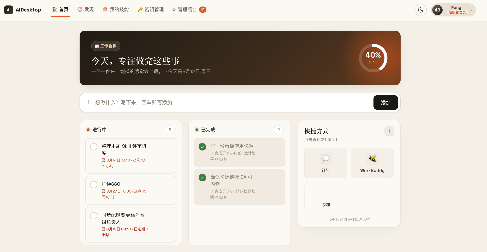

# AI Desktop

---------------

[](./LICENSE)
[](https://www.python.org)
[](https://docs.astral.sh/ruff/)

---



## 功能特性

- **发现页：浏览、安装并复用经过审核的Skill**
- **Skill 提交、审核与版本管理**
- **API Key 申请与管理**
- **个人工作看板**

---

## 快速开始

### 环境要求

- Python ≥ 3.12
- 推荐包管理器：[`uv`](https://github.com/astral-sh/uv)（仓库已含 `uv.lock`）；也可使用 `pip` + 虚拟环境。

### 安装与运行

** 使用 uv（推荐）**

```bash
# 在项目根目录
uv sync                 # 根据 pyproject.toml / uv.lock 安装依赖
uv run uvicorn ai_desktop.main:app --reload --port 8001
```


### 访问

启动后默认地址：

- 应用首页：<http://localhost:8001/>
- 健康检查：<http://localhost:8001/health> → `{"ok": true}`
- 未登录访问任意页面会自动跳转登录页 `/login`

> 数据库与演示数据在应用启动时由 `init_db()` 自动创建并写入。

### （可选）注入更丰富的演示数据

```bash
uv run python -m ai_desktop.mock_data
```

该脚本以 Skill 名称为唯一键幂等注入，包含多版本、密钥申请与员工示例数据，便于演示审核、角色等完整流程。

---

### 角色与权限

| 角色 | 权限 |
| --- | --- |
| `super_admin`（超级管理员） | 全部权限：审核 Skills、审核密钥、管理员工与角色、查看反馈 |
| `skills_admin`（Skills 管理员） | 审核 Skill 提交（通过 / 拒绝） |
| `key_admin`（密钥管理员） | 审核 API Key 申请（分配 / 拒绝 / 吊销） |

权限通过 `CurrentUser.has_role()` 校验，`super_admin` 隐含拥有所有权限。

> 导航栏右上角只展示当前用户**权限最高的单个角色**（优先级 `super_admin` > `key_admin` > `skills_admin`），而非全部角色拼接展示。

---

## 配置说明

- **会话密钥**：`ai_desktop/deps.py` 中的 `SECRET_KEY` 用于 HMAC 签名会话 Cookie，当前为演示硬编码值，**生产环境务必替换为随机强密钥**。
- **会话有效期**：`SESSION_MAX_AGE = 30 天`；登录页勾选「记住我」后写入持久 Cookie，否则为 Session Cookie。
- **数据库路径**：`data/skillhub.db`（SQLite），附件存于 `data/attachments/`，均在首次运行时自动创建。
- **公开路径**：`/login`、`/api/auth/login`、`/api/auth/logout`、`/health` 及 `/static/` 无需登录即可访问。

### 阿里云 AI Gateway 对接配置

对接阿里云云原生 API 网关（APIG，API 版本 `2024-03-27`），客户端实现在 `ai_desktop/aliyun_aigw.py`，路由在 `ai_desktop/routers/aigw.py`。**用量看板全员可见，且为纯个人视角**（只展示本人绑定消费组的用量，页面无任何管理员覆盖入口）；**消费者管理**已并入「管理后台 → 密钥审核 → 消费组管理」标签页（仅超级管理员可创建/删除）。

配置（环境变量，也可写入项目根目录 `.env`，已提供 `.env.example` 模板；`.env` 已被 `.gitignore` 忽略）：

| 变量 | 说明 | 默认值 |
| --- | --- | --- |
| `ALIYUN_ACCESS_KEY_ID` | 阿里云 AccessKey ID | 空（缺省时自动走 mock） |
| `ALIYUN_ACCESS_KEY_SECRET` | 阿里云 AccessKey Secret | 空 |
| `ALIYUN_REGION` | 地域 | `cn-hangzhou` |
| `ALIYUN_APIG_HOST` | APIG 控制面域名 | `apig.{region}.aliyuncs.com` |
| `ALIYUN_APIG_GATEWAY_ID` | 网关 ID（配额用量必需） | 空 |
| `ALIYUN_APIG_QUOTA_RULE_ID` | 配额规则 ID（配额用量必需） | 空 |
| `ALIYUN_APIG_SUBJECT_ID` | 默认查询主体（消费者）ID | 空 |
| `AIGW_USE_MOCK` | 是否使用 mock 数据：`1` 开 / `0` 关 | 自动：无 AK/SK 时为 `1` |

> **Mock / 生产切换**：本地无真实凭据时（`ALIYUN_ACCESS_KEY_ID` 等未配置，或 `AIGW_USE_MOCK=1`）走 mock 数据分支，返回结构与真实接口一致，可直接驱动图表与列表展示。
> **上生产时**：设 `AIGW_USE_MOCK=0`、配置真实 AK/SK 与网关/配额规则 ID，并将 `ai_desktop/aliyun_aigw.py` 中 `_mock_*` 分支整段删除或注释即可。

已对接接口：

| 阿里云 API | 本项目方法 / 路由 | 说明 |
| --- | --- | --- |
| `CreateConsumer` (POST `/v1/consumers`) | `POST /api/aigw/consumers` | 创建消费者 |
| `DeleteConsumer` (DELETE `/v1/consumers/{id}`) | `DELETE /api/aigw/consumers/{id}` | 删除消费者 |
| `ListConsumers` (GET `/v1/consumers`) | `GET /api/aigw/consumers` | 列出消费者（管理页用） |
| `GetGatewayQuotaRuleSubjectUsage` (GET `/v1/gateways/{gwId}/quota-rules/{ruleId}/subjects/{subjectId}/usage`) | `GET /api/aigw/quota/usage` | 获取积分用量（驱动图表） |

页面：`/`（默认主页，**个人工作看板**）、`/discover`（发现页，导航栏「发现」Tab）、`/aigw`（积分用量看板，由四列概览指标（已用 / 总配额 / 剩余 / 使用率）+ 两个图表组成，**全员可见、纯个人视角**，默认展示本人绑定消费组的用量；入口在右上角用户下拉「我的用量」，**不占用**导航栏 Tab）、`/admin/key-reviews`（密钥审核页，其中「消费组管理」Tab 负责消费者的创建/删除/列表，**仅超级管理员可操作**，入口：`/aigw/consumers` 会重定向至此）。

**本人用量如何关联**：在「密钥审核 → 分配密钥」时，管理员从下拉选择某个 AI Gateway 消费组并分配；该密钥的 `consumer_id` 即成为持有人的用量主体。访问 `/aigw` 时后端按当前登录用户查找其已分配密钥绑定的消费组，自动拉取对应积分用量。未绑定消费组的用户会看到友好的空状态提示（演示/Mock 模式下为保证图表可展示，会用派生 subject 渲染示例数据）。

---

## 代码规范

- 使用 [ruff](https://docs.astral.sh/ruff/) 做静态检查与导入排序，规则在 `pyproject.toml` 的 `[tool.ruff]` 中配置。
- 本地检查：`uv run ruff check .`
- 持续集成：`.github/workflows/ci.yml` 在 push / PR 时自动运行 `ruff check` 并做导入冒烟测试。

---

## 许可证

[Apache License 2.0](./LICENSE)
