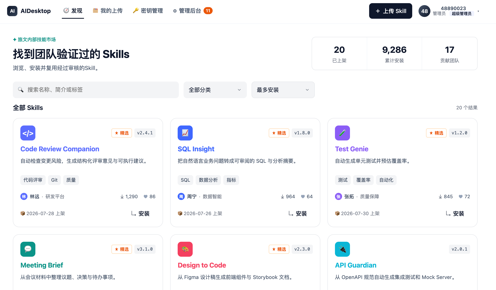

# AI Desktop — 企业 AI Skill 共享与管理平台

---------------

[](./LICENSE)
[](https://www.python.org)
[](https://docs.astral.sh/ruff/)

---



## 功能特性

- **发现页（首页）**：已发布 Skill 卡片瀑布流，按下载量排序，支持按分类筛选、点赞、查看详情与安装。
- **Skill 提交与版本管理**：上传 Skill（含 `.zip` 附件），支持草稿 / 待审核 / 已发布 / 已拒绝 / 已替代多状态；可从已发布版本「迭代」出新版本。
- **我的上传**：贡献者跟踪自己提交的所有版本及其状态（全部 / 待审核 / 草稿 / 已通过）。
- **Skills 审核后台**：管理员对待审核版本进行通过 / 拒绝，通过时可标记精选（featured），自动将旧版本置为「已替代」。
- **API Key 管理**：员工申请 API Key，密钥管理员审核分配 / 拒绝 / 吊销（密钥脱敏展示）。
- **超级管理员后台**：员工与角色管理（超级管理员 / Skills 管理员 / 密钥管理员）、Skill 审核、密钥审核、用户反馈四大子模块。
- **用户反馈**：任意登录用户可提交反馈，超级管理员可查看并标记已读。
- **演示数据**：首次启动自动写入种子数据；另有更丰富的 `mock_data` 注入脚本用于演示。

---

## 技术栈

| 分类 | 技术 |
| --- | --- |
| 语言 | Python ≥ 3.12 |
| Web 框架 | FastAPI |
| ORM | SQLAlchemy 2.x |
| 模板 | Jinja2（服务端渲染 HTML） |
| 表单 / 上传 | python-multipart |
| 服务器 | Uvicorn（`uvicorn[standard]`） |
| 数据库 | SQLite（文件型，零运维） |
| 其他依赖 | `requests`、`ipython`、`alibabacloud-computenest20210601`（预留云集成） |

---

## 项目结构

```
ai-desktop/
├── ai_desktop/
│   ├── __init__.py
│   ├── main.py            # FastAPI 入口：create_app()、认证中间件、/health
│   ├── database.py        # SQLite 引擎、Session 工厂、init_db()
│   ├── deps.py            # 角色常量、会话 token（HMAC 签名）、CurrentUser、公开路径
│   ├── models.py          # ORM 模型：Skill / SkillVersion / Category / ApiKey / Employee / Feedback
│   ├── schemas.py         # Pydantic 校验模型（NewSkillSubmission / ReviewDecision）
│   ├── seed.py            # 首次启动自动写入的种子数据（幂等）
│   ├── mock_data.py       # 可手动运行的更丰富演示数据注入器
│   ├── routers/
│   │   ├── auth.py        # 登录 / 登出页面与 API
│   │   ├── pages.py       # 发现页、我的上传、/reviews 重定向
│   │   ├── submissions.py # Skill 上传 / 提交 / 撤回 / 迭代 / 下载 / 点赞
│   │   ├── reviews.py     # Skill 审核 API
│   │   ├── keys.py        # API Key 申请与审核（页面 + API）
│   │   ├── admin.py       # 用户 / 角色管理、各审核子页面
│   │   └── feedback.py    # 用户反馈提交与查看
│   ├── static/            # CSS / JS 静态资源
│   └── templates/         # Jinja2 模板（base、首页、各后台页、局部组件）
├── data/                  # 运行时数据（SQLite 库 + 附件），建议加入 .gitignore
│   ├── skillhub.db
│   └── attachments/<skill_id>/<version_id>.zip
├── pyproject.toml
├── uv.lock
└── LICENSE                # Apache License 2.0
```

---

## 快速开始

### 环境要求

- Python ≥ 3.12
- 推荐包管理器：[`uv`](https://github.com/astral-sh/uv)（仓库已含 `uv.lock`）；也可使用 `pip` + 虚拟环境。

### 安装与运行

**方式一：使用 uv（推荐）**

```bash
# 在项目根目录
uv sync                 # 根据 pyproject.toml / uv.lock 安装依赖
uv run uvicorn ai_desktop.main:app --reload --port 8001
```

**方式二：使用 pip + 虚拟环境**

```bash
python -m venv .venv
source .venv/bin/activate
pip install -e .
uvicorn ai_desktop.main:app --reload --port 8001
```

### 访问

启动后默认地址：

- 应用首页：<http://localhost:8001/>
- 健康检查：<http://localhost:8001/health> → `{"ok": true}`
- 未登录访问任意页面会自动跳转登录页 `/login`

> 数据库与演示数据在应用启动时由 `init_db()` 自动创建并写入。

### （可选）注入更丰富的演示数据

```bash
uv run python -m ai_desktop.mock_data
```

该脚本以 Skill 名称为唯一键幂等注入，包含多版本、密钥申请与员工示例数据，便于演示审核、角色等完整流程。

---

## 默认账号与角色

项目内置测试账号与演示用户（定义在 `ai_desktop/deps.py`）：

| 工号 | 姓名 | 角色 |
| --- | --- | --- |
| `admin` / `admin` | 管理员 | 超级管理员（`super_admin`） |
| `10020002` | 李娜 | 密钥管理员（`key_admin`） |
| `10020003` | 王强 | Skills 管理员（`skills_admin`） |

> 登录方式：用户名 `admin`、密码 `admin`。（注意：当前为演示用硬编码账号，生产环境需接入真实身份认证。）

### 角色与权限

| 角色 | 权限 |
| --- | --- |
| `super_admin`（超级管理员） | 全部权限：审核 Skills、审核密钥、管理员工与角色、查看反馈 |
| `skills_admin`（Skills 管理员） | 审核 Skill 提交（通过 / 拒绝） |
| `key_admin`（密钥管理员） | 审核 API Key 申请（分配 / 拒绝 / 吊销） |

权限通过 `CurrentUser.has_role()` 校验，`super_admin` 隐含拥有所有权限。

---

## 数据模型

核心实体（ORM，见 `ai_desktop/models.py`）：

- **Skill**：技能主表（市场卡片展示字段）——`name`、`icon`、`accent_color`、`short_description`、`category`、`owner_name`、`owner_team`、`downloads`、`likes`、`is_featured`。
- **SkillVersion**：版本表，承载审核流程——`version`、`summary`、`detail`、`changelog`、`scope`（公开 / 部门内可见）、`status`、`tags`（JSON 字符串）、`attachment_path`（zip）、`submitted_by` / `decided_by` / `decision_note`。
- **Category**：首页分类下拉选项。
- **ApiKey**：密钥申请记录——`applicant_id`、`applicant_name`、`purpose`、`status`、`api_key_value`（脱敏展示）、`reviewed_by`。
- **Employee**：员工表——`id`（工号）、`name`、`department`、`roles`（JSON 字符串）。
- **Feedback**：用户反馈——`content`、`employee_id`、`employee_name`、`is_read`。

### SkillVersion 状态机

```
draft ──submit──▶ pending ──approve──▶ published ──(新版本 approve)──▶ superseded
                     │
                     └───────reject────────▶ rejected
pending ──withdraw──▶ draft
```

---

## API 一览

### 认证与基础

| 方法 | 路径 | 说明 |
| --- | --- | --- |
| GET | `/login` | 登录页面 |
| POST | `/api/auth/login` | 登录，签发会话 Cookie |
| GET | `/api/auth/logout` | 登出，清除 Cookie |
| GET | `/health` | 健康检查 |

### 页面路由

| 方法 | 路径 | 说明 |
| --- | --- | --- |
| GET | `/` | 发现页（已发布 Skill 市场） |
| GET | `/my-uploads` | 我的上传 |
| GET | `/keys` | API Key 申请与管理页 |
| GET | `/admin` | 超级管理员后台（用户 / 角色） |
| GET | `/admin/skill-reviews` | Skills 审核子页（`skills_admin`） |
| GET | `/admin/key-reviews` | 密钥审核子页（`key_admin`） |
| GET | `/admin/feedback` | 用户反馈子页（`super_admin`） |

### Skill 提交与版本

| 方法 | 路径 | 说明 |
| --- | --- | --- |
| GET | `/api/skills/check-name` | 新建时名称查重 |
| POST | `/api/skills/upload` | 上传 / 创建 Skill（`publish_now` 可跳过审核直接上架） |
| POST | `/api/skills/{id}/submit` | 草稿 / 已拒绝 → 待审核 |
| POST | `/api/skills/{id}/withdraw` | 待审核 → 草稿（撤回） |
| POST | `/api/skills/{id}/edit` | 编辑版本并重新提交审核 |
| GET | `/api/skills/{id}/download` | 下载已发布版本 zip（计数 +1） |
| GET | `/api/skills/{id}/card` | 安装弹窗所需的卡片 JSON |
| POST | `/api/skills/{id}/toggle-like` | 点赞 / 取消点赞 |
| POST | `/api/skills/{id}/iterate` | 基于已发布版本创建新迭代版本 |

### 审核

| 方法 | 路径 | 说明 |
| --- | --- | --- |
| GET | `/api/reviews/{id}` | 审核弹窗 payload |
| POST | `/api/reviews/{id}/decide` | 通过 / 拒绝（`decision=approve｜reject`，拒绝必填意见） |

### API Key

| 方法 | 路径 | 说明 |
| --- | --- | --- |
| POST | `/api/keys/apply` | 申请密钥（同一用户仅允许一个在用密钥） |
| POST | `/api/keys/{id}/approve` | 审核通过并分配密钥（`key_admin`） |
| POST | `/api/keys/{id}/reject` | 拒绝申请（`key_admin`，必填说明） |
| POST | `/api/keys/{id}/revoke` | 吊销已分配密钥（本人或 `key_admin`，必填原因） |

### 管理与反馈

| 方法 | 路径 | 说明 |
| --- | --- | --- |
| GET | `/api/employees/{id}` | 员工详情（`super_admin`） |
| POST | `/api/employees/{id}/roles` | 修改角色（`super_admin`） |
| POST | `/api/employees` | 新建员工（`super_admin`） |
| POST | `/api/feedback` | 提交反馈（任意登录用户） |
| POST | `/api/feedback/{id}/read` | 单条标记已读（`super_admin`） |
| POST | `/api/feedback/read` | 批量标记已读（`super_admin`） |

---

## 配置说明

- **会话密钥**：`ai_desktop/deps.py` 中的 `SECRET_KEY` 用于 HMAC 签名会话 Cookie，当前为演示硬编码值，**生产环境务必替换为随机强密钥**。
- **会话有效期**：`SESSION_MAX_AGE = 30 天`；登录页勾选「记住我」后写入持久 Cookie，否则为 Session Cookie。
- **数据库路径**：`data/skillhub.db`（SQLite），附件存于 `data/attachments/`，均在首次运行时自动创建。
- **公开路径**：`/login`、`/api/auth/login`、`/api/auth/logout`、`/health` 及 `/static/` 无需登录即可访问。

---

## 代码规范

- 使用 [ruff](https://docs.astral.sh/ruff/) 做静态检查与导入排序，规则在 `pyproject.toml` 的 `[tool.ruff]` 中配置。
- 本地检查：`uv run ruff check .`
- 持续集成：`.github/workflows/ci.yml` 在 push / PR 时自动运行 `ruff check` 并做导入冒烟测试。

---

## 许可证

[Apache License 2.0](./LICENSE)
